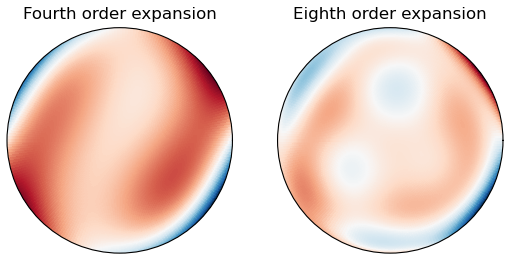

# zernike
Python-based zernike expansion calculator. 


## Example

By calling the methods in ```zernike.py``` you can evaluate the Zernike expansion over any desired unit circular aperture. Consider the example below (included in the script as well):

``` python
import numpy as np
import matplotlib.pyplot as plt

from zernike import zernike_expansion

r, t = np.linspace(0, 1, 2**8), np.linspace(-np.pi, np.pi, 2**8)
R, T = np.meshgrid(r, t)

# Two lists of coefficients up to some order

fourth_order_coeffs = {
                                                 'Z00':1.0,
                                            'Z1m1':0.0, 'Z11':0.0,
                                    'Z2m2':3.0, 'Z20':1.0, 'Z22':-1.5,
                                'Z3m3':0.1, 'Z3m1':1.0, 'Z31':0.5, 'Z33':0.3,
                         'Z4m4':1.5, 'Z4m2':3.0, 'Z40':2.00, 'Z42':1.0, 'Z44':0.2,
}

eighth_order_coeffs = {
                                                 'Z00':1.0,
                                            'Z1m1':0.0, 'Z11':0.0,
                                    'Z2m2':3.0, 'Z20':1.0, 'Z22':-1.5,
                                'Z3m3':0.1, 'Z3m1':1.0, 'Z31':0.5, 'Z33':0.3,
                         'Z4m4':1.5, 'Z4m2':3.0, 'Z40':2.00, 'Z42':1.0, 'Z44':0.2,
                    'Z5m5':0.0, 'Z5m3':0.0, 'Z5m1':0.0, 'Z51':0.0, 'Z53':0.0, 'Z55':0.0,
             'Z6m6':-0.5, 'Z6m4':0.0, 'Z6m2':0.0, 'Z60':0.0, 'Z62':0.0, 'Z64':0.0, 'Z66':0.0,
        'Z7m7':0.0, 'Z7m5':0.0, 'Z7m3':2.0, 'Z7m1':0.0, 'Z71':0.0, 'Z73':0.0, 'Z75':0.0, 'Z77':0.0,
 'Z8m8':0.0, 'Z8m6':0.0, 'Z8m4':0.0, 'Z8m2':0.0, 'Z80':-1.0, 'Z82':0.0, 'Z84':0.0, 'Z86':0.0, 'Z88':0.0,
}

fourth_order = zernike_expansion(R, T, fourth_order_coeffs)
eighth_order = zernike_expansion(R, T, eighth_order_coeffs)

plt.figure()
ax = plt.subplot(121, polar=True)
ax.set_title('Fourth order expansion')
ax.pcolor(T, R, fourth_order, cmap='RdBu', shading='auto')
ax.set_yticks([]), ax.set_xticks([])
ax = plt.subplot(122, polar=True)
ax.set_title('Eighth order expansion')
ax.pcolor(T, R, eighth_order, cmap='RdBu', shading='auto')
ax.set_yticks([]), ax.set_xticks([])
plt.show()
```
which outputs the following figure:

